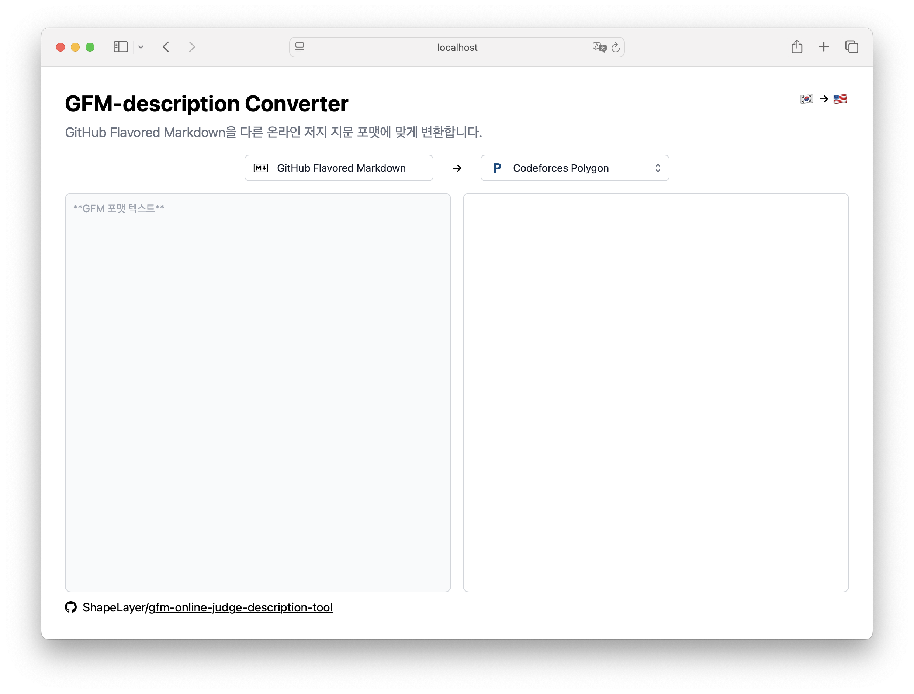

# GFM to Online Judge Description Formats Converter



Web ui wrapper for [cmark-gfm](https://github.com/github/cmark-gfm) and [gfm2polygon-statement](https://github.com/shapelayer/gfm2polygon-statement)

Converts GitHub Flavored Markdown to Polygon's statement LaTeX and BOJ Stack's description DOM.

## Getting Started
This repository doesn't include the build of cmark-gfm and gfm2polygon-statement.

When building the library, Emscripten, the c/c++ wasm compiler is required. Refer to [&lt;Download and install&gt;](https://emscripten.org/docs/getting_started/downloads.html) in the Emscripten documentation.

```sh
# initialize
git submodule update --init
npm install
npm run compile:lib
# run
npm run dev
```

```sh
# build script runs compile:lib before building the web ui source code.
npm run build
```
